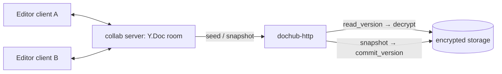

# Phase 2 — Build Spec

Implementation-level target for **Phase 2 — native embedded editing + real-time co-editing**. Read with [`phase-1-build.md`](./phase-1-build.md), [`../ARCHITECTURE.md`](../ARCHITECTURE.md) (§"Embedded editing"), [`../../PLAN.md`](../../PLAN.md) (Phase 2), and [`../TESTING.md`](../TESTING.md).

**Phase 2 goal:** open a document *inside* Doc-Hub in its native editor, edit (alone or with others in real time), and have every save land as an encrypted, hash-chained version — one app, no launcher. This binds the editor UIs (already partly present in `web/`) to the encrypted version engine and the `collab` server.

**Depends on Phase 0/1** (merged): the encrypted storage facade + `Registry` (`commit_version`/`read_version`), the editor access token seam, the version-history API. The sibling **`collab`** server (Hocuspocus + Yjs, relays opaque document bytes) and the editor SDKs (`@casualoffice/sheets`, the docx editor) are external dependencies.

**Non-goals (Phase 2):** search/AI, zero-knowledge E2E of CRDT traffic (the server is trusted — it decrypts to seed rooms), offline editing, PDF *editing* (view only until Casual PDF ships an editor).

---

## 1. Editing model (single-user first, then collab)

```
open → app-origin mints an editor access token (P0 seam)
     → server decrypts head version bytes in memory (Registry::read_version)
     → streams them to the embedded editor (Sheet/Docs SDK) over the app origin
     → user edits
     → save → editor emits bytes → PUT /api/files/{id}/content → commit_version
             → new encrypted hash-chained version + audit(version.commit) + reindex-enqueue
```
Single-user editing is mostly wired (P0 read/write path). Phase 2 §2 makes it *native embedded* in the shell; §3 adds real-time collab.

## 2. Embedded editor surface (`web/`)

- A route `/document/{id}/edit` that mounts the correct editor by kind: `.xlsx`→Sheet SDK, `.docx`→docx editor, `.md/.txt/.csv/.json/.yaml`→a light CodeMirror/textarea editor. `.pdf`/opaque → view-only (preview surface).
- The editor host: fetch head bytes via the content endpoint (decrypted stream), hand to the SDK; on the SDK's save/change-commit, `PUT /content` → new version. Show the version chip + a "saved as v{n}" affordance tied to the version-history surface (M2).
- Dense Doc-Hub chrome around the editor (toolbar owned by the SDK; our chrome = title, version, presence, close). Reuse `ds/` primitives + tokens.
- **Acceptance:** open→edit→save round-trips a `.docx` and `.xlsx` with fidelity parity to the standalone editors (e2e UC-3); each save creates an ordered version visible in the history surface.

## 3. Real-time co-editing (`collab` server + `dochub-http` + `web/`)

The `collab` server owns the live `Y.Doc` per room and relays CRDT updates; it never parses documents. Doc-Hub owns the encrypted canonical bytes and the version chain.



- **Room seeding:** on first join, `dochub-http` decrypts the head version and seeds the collab room (the room holds plaintext OOXML bytes — acceptable under the server-trusted model; document this in the security brief). Subsequent joiners sync from the room.
- **Snapshot → version:** on a debounced idle / explicit save / last-peer-leaves, the merged room bytes are snapshotted, encrypted, and `commit_version`ed (a new hash-chained version, audited). Never commit on every keystroke.
- **Auth:** the collab connection carries the editor access token (`(user_id, file_id, perms, exp, jti)`); `collab` validates it (or `dochub-http` brokers the room grant). Per-document rooms; workspace membership enforced.
- **Config:** `DOCHUB_COLLAB_URL` (opt-in). With no collab server configured, editing falls back to single-user (§2) — co-editing is additive, never required.
- **Acceptance:** two clients edit one document; both see live updates; on save the merged result lands as a single new ordered version (e2e UC-5).

## 4. Presence (`dochub-http` SSE + `web/`)

Reuse the existing presence layer (Phase-0 research §14): coarse per-document presence (who's viewing/editing, avatar stack) over SSE at the shell/vault level; fine-grained cursors are the `collab` server's job inside the editor. An `editing` signal distinct from `viewing`.

## 5. WOPI (optional interop, unchanged)

WOPI stays gated behind `DOCHUB_WOPI_ENABLED=false`. The embedded path is primary; WOPI remains for external Office clients only.

## 6. Test matrix (maps to `docs/TESTING.md`)

| Invariant / UC | Where |
|---|---|
| UC-3 open→edit→save round-trip (docx/xlsx) | `web/` e2e against real backend |
| UC-5 two-client co-edit → ordered versions | `web/` + `collab` integration/e2e |
| save = new encrypted hash-chained version | `dochub-http` integration (already green in P0/P1) |
| no plaintext at rest (snapshots) | reuse the P0 spy-backend invariant #1 |
| editor token separation | invariant #10 |

## 7. PR sequence

1. **P2.1** Embedded single-user editor surface in `web/` (route + host + save→version), on real APIs.
2. **P2.2** `collab` room brokering in `dochub-http` (token grant, seed endpoint) + `DOCHUB_COLLAB_URL` config.
3. **P2.3** Wire the editor clients to `collab` (co-edit) + snapshot→`commit_version` on idle/leave.
4. **P2.4** Presence (`editing` signal + avatar stack in the shell/editor).

## 8. Decisions

- **D1 — Snapshot trigger:** debounced-idle + last-peer-leaves vs explicit-save-only. *Recommendation:* debounced-idle **and** last-peer-leaves, with an explicit "Save version" button — so history isn't polluted by every pause but nothing is lost.
- **D2 — Room seed source of truth:** always head version vs. persisted room snapshot. *Recommendation:* head version on cold start; the room is ephemeral, the version chain is canonical.
- **D3 — Markdown/text editor:** CodeMirror 6 vs. a minimal controlled textarea. *Recommendation:* CodeMirror 6 (mermaid/preview later), behind the same save→version contract.
